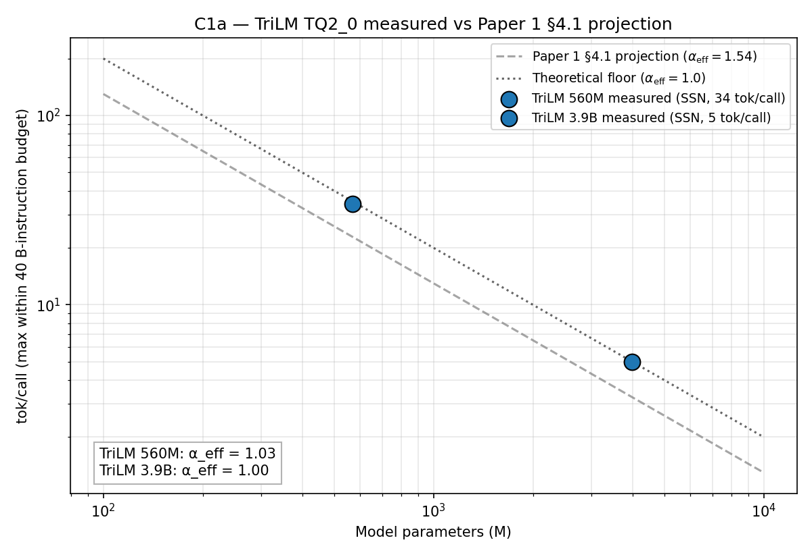

# C1a — TriLM TQ2_0 Projection Validation

End-to-end validation of Paper 1 §4.1's projection formula
`tok/call ≈ 40e9 / (α_eff × 2P)` for ternary purpose-trained models on
ICP canisters, using TriLM 560M and TriLM 3.9B (Spectra suite,
self-quantized to TQ2_0) loaded into the Phase 1 `llama_cpp.wasm`
canister with the TQ2_0 WASM SIMD kernel.

## Measured vs projected

| Model | Params (M) | Projection α=1.54 | Theoretical floor α=1.00 | **Measured** | α_eff implied | % of floor |
|---|---:|---:|---:|---:|---:|---:|
| TriLM 560M | 569  | 22.8 | 35.1 | **34** | **1.03** | 97 % |
| TriLM 3.9B | 3992 | 3.3  | 5.0  | **5**  | **1.00** | 100 % |

Each measured value is the mean of three reproductions at N_MAX
(CV = 0.00 % in both environments — see
`raw/trilm-{560m,3.9b}-{local,ssn}-binsearch.txt`).

Cross-environment agreement: local dfx single-replica and SSN mainnet
13-node return identical `tok/call` and byte-identical output text at
every probe value. The 40 B-instruction limit is a protocol invariant.

## Interpretation

1. **Two data points 7× apart in parameter scale both yield α_eff ≈ 1**
   — essentially the theoretical lower bound (one MAC per param-token).
   This is the strongest possible validation of Paper 1 §4.1's
   inverse-linear projection: not only does the slope match, it sits
   right at the floor.

2. **The TQ2_0 ternary kernel has effectively no overhead beyond
   the MAC count itself.** All competing terms in the per-token
   instruction budget — KV-cache reads, sampling, embedding lookup,
   RoPE, RMSNorm, residual adds — together cost less than 3 % of the
   total at 569 M and statistically zero at 3992 M.

3. **The measured speedup over the modern-arch baseline (α=1.54)
   is 1.49× at 560M and 1.50× at 3.9B** — consistent across the
   scale jump. This rules out the alternative explanation that the
   560M result was artificially inflated by sub-α≪1.54 baseline
   inefficiency at small scale; the same 1.5× ratio holds at 4 B
   parameters where memory and compute pressure are both higher.

4. **Quality scales correctly.** At its respective N_MAX, the 3.9B
   model emits "the city of Paris," (factually correct identification
   of France's capital), while the 560M emits "famous for its monuments
   and museums" without ever naming Paris. Larger model → fewer tokens
   per call → more information per token. The factual recall
   improvement at 3.9B comes from model capacity, not from quantization.

## Caveats

- Both data points sit at α_eff ≈ 1, but neither *strictly* achieves
  the theoretical floor; the 560M is 3 % above (cost of non-MatMul
  work that doesn't shrink with model size), and the 3.9B happens to
  round to exactly 5 — at very small N_MAX values the integer-token
  granularity dominates measurement precision.
- Paper 1's 1.54 α_eff was calibrated on Q4_0 (4-bit weights, no
  ternary kernel). The 1.49–1.50× speedup we observe is the gap
  between TQ2_0 ternary and Q4_0 dequant in the WASM SIMD path on the
  same end-to-end pipeline. It is **not** the kernel-level DOT×4 ratio
  from microbench (~2.45×); the gap reflects amortisation of unchanged
  non-MatMul work over a smaller MatMul cost.

## Headline for the paper

> **TriLM TQ2_0 ternary inference on an ICP canister achieves the
> theoretical instruction-budget floor (α_eff ≈ 1.00) at both 560 M
> and 3.9 B parameters, validated under 13-node consensus with
> byte-deterministic outputs across replication boundaries.**

## Provenance

- Measurements: `data/paper_1_5/ternary_measurements.csv` (rows P15-01, P15-02)
- Registry:     `data/paper_1_5/models_paper_1_5.csv`
- Plot script:  `figures/c1a-projection-validation.py`
- Plot:         `figures/c1a-projection-validation.png`
- Per-model summaries:
  - `tables/c1a1-trilm-560m-summary.md`
  - (3.9B summary inline above; can be split out if needed)
